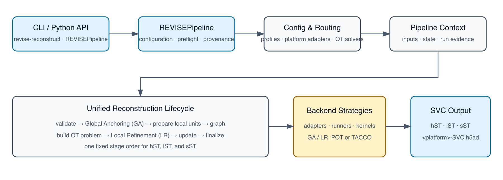

# REVISE

<p align="center">
  
  
  
</p>

[](https://pypi.org/project/revise-svc/)
[](https://revise-svc.readthedocs.io/en/latest/?badge=latest)
[](LICENSE)

REVISE (REconstruction via Vision-integrated Spatial Estimation) reconstructs
**Spatially-inferred Virtual Cells (SVCs)** from spatial transcriptomics data
by integrating ST measurements, spatial or morphology-derived priors when
available, and matched single-cell RNA-seq references. The public input layer
uses AnnData/H5AD by default and optionally accepts SpatialData Zarr tables.

The codebase is organized around one configuration-driven engine,
`REVISEPipeline`, and two user-facing modes:

| Mode | Goal | Main entry points | Primary outputs |
| --- | --- | --- | --- |
| `benchmark` | Reproduce Sim2Real-ST evaluations across six confounding factors | `benchmark_main.py`, `benchmark_main.sh`, `reproduce/benchmark/*.ipynb` | `metrics_normalized.csv` with PCC, SSIM, MSE, and NRMSE |
| `application` | Reconstruct SVCs and run downstream real-data analysis | `revise-reconstruct`, `reconstruct.py`, `reproduce/case/*.ipynb` | `<output-root>/<sample-name>/<platform>-SVC.h5ad` and notebook figures |

Documentation: <https://revise-svc.readthedocs.io/en/latest/>

Dataset and reproduced results: <https://zenodo.org/records/17705737>

## What REVISE Covers

Sim2Real-ST benchmarks six confounding factors across three spatial
transcriptomics platform types:

- Spatially heterogeneous factors: image segmentation artifacts and bin-to-cell
  assignment errors.
- Spatially homogeneous factors: spot size, batch effect, gene panel
  limitation, and gene dropout.


<p align="center">Confounding factors that limit current spatial transcriptomics technologies</p>

REVISE reconstructs two complementary SVC types:

- `sp-SVC`: spatial refinement for hST platforms such as Visium HD.
- `sc-SVC`: molecular completion and cell-state refinement for iST/sST
  platforms such as Xenium and Visium.


<p align="center">Overview of the REVISE framework</p>

## Architecture

Modern reconstruction runs flow through:

1. `revise-reconstruct`, `reconstruct.py`, or `revise.framework.REVISEPipeline`
2. `revise/revise.yaml` profiles and runtime/IO overrides
3. `revise.recon.pipeline.UnifiedReconstructionPipeline`
4. backend strategies, platform adapters, and OT kernels in `revise/backend/`

`UnifiedReconstructionPipeline` owns one fixed lifecycle: input validation,
Global Anchoring (GA), local-unit preparation, graph and OT problem
construction, Local Refinement (LR), expression update, SVC finalization, and
optional benchmark evaluation. Both GA and LR can use POT or TACCO.



<p align="center">Current configuration-driven REVISE architecture</p>

Compatibility runner classes remain under `revise/backend/runners/` for the
paper notebooks and parity checks. New application runs should use
`revise-reconstruct`, `reconstruct.py`, or `REVISEPipeline`.

## Installation

### Published PyPI release

Install the published release line with:

```bash
python -m pip install revise-svc
```

PyPI currently publishes `0.0.32`. That release predates the `0.1.0rc1`
source candidate documented below, including its unified reconstruction CLI,
two-stage POT/TACCO selection, and current optional dependency groups.

### Current source candidate

To use the current repository implementation:

```bash
git clone https://github.com/wuys13/REVISE.git
cd REVISE
python -m pip install .
```

For an editable development install:

```bash
python -m pip install -e ".[dev]"
```

POT, Leiden, and the core scientific stack are base dependencies. Install
optional domains only when needed:

```bash
python -m pip install ".[tacco]"       # TACCO 0.5.0 as an OT solver
python -m pip install ".[pathway]"     # pathway analysis notebooks
python -m pip install ".[cci]"         # CCI analysis notebooks
python -m pip install ".[trajectory]"  # trajectory analysis notebooks
python -m pip install ".[spatialdata]" # SpatialData Zarr input
```

The CCI extra installs Python dependencies only; it does not download a
CellPhoneDB database. Installation does not download research data.

## Quick Start

### Benchmark Mode

`benchmark_main.py` runs one Sim2Real-ST confounding family and writes
per-gene PCC, SSIM, MSE, and NRMSE metrics:

```bash
python benchmark_main.py \
  --confounding segmentation \
  --data-root raw_data/Sim2Real-ST \
  --sample-name P2CRC/cut_part1 \
  --dataset-task segmentation \
  --output-root output/benchmark
```

Supported `--confounding` values are `segmentation`, `bin2cell`,
`batch_effect`, `spot_size`, `gene_panel`, and `gene_dropout`. Use the bounded
multi-family launcher for the paper workflow:

```bash
bash benchmark_main.sh
```

### Application Mode


<p align="center">Biological insights enabled by SVC reconstruction</p>

For `--sample-name sample`, `--st-file st.h5ad`, and
`--sc-ref-file sc_ref.h5ad`, prepare the flat input layout resolved by the CLI:

```text
data/
├── sample_st.h5ad
└── sc_ref.h5ad
```

Run hST reconstruction with POT:

```bash
revise-reconstruct \
  --platform hST \
  --sample-name sample \
  --data-root data \
  --st-file st.h5ad \
  --sc-ref-file sc_ref.h5ad \
  --output-root output \
  --ot-method pot
```

Use `--platform iST` or `--platform sST` for the other routes. From a source
checkout, `python reconstruct.py` delegates to the same CLI implementation.
Append `--dry-run` to validate resolved inputs and dependencies without
running reconstruction.

Every successful application run publishes one stable-facing result:

```text
<output-root>/<sample-name>/<platform>-SVC.h5ad
```

The concrete names are `hST-SVC.h5ad`, `iST-SVC.h5ad`, and `sST-SVC.h5ad`.
The result records a link to the canonical run's `provenance.json`.

Historical `application_sp_SVC_recon.py` and
`application_sc_SVC_recon.py` entry points remain for notebook compatibility;
they are not the recommended installed interface and retain notebook-specific
output copies.

### POT and TACCO

REVISE exposes two OT stages:

- GA (Global Anchoring): `ot.ga.solver`
- LR (Local Refinement): `ot.lr.solver`

`--ot-method pot` or `--ot-method tacco` selects the same solver for both
stages. Omit the option to retain the merged configuration, including a mixed
selection configured with `--set ot.ga.solver=...` and
`--set ot.lr.solver=...`. TACCO is optional and pinned to 0.5.0; a requested
TACCO run fails explicitly rather than falling back to POT.

### Minimal Input Format

Both input files need non-empty `X`, unique `obs_names`, unique `var_names`,
and at least one shared gene. The ST input also needs two-dimensional
coordinates in `obsm["spatial"]`.

| File | Required fields | Meaning |
| --- | --- | --- |
| `st.h5ad` | `X`, `var_names`, `obsm["spatial"]` | Spatial unit by gene matrix and two spatial coordinates per row |
| `sc_ref.h5ad` | `X`, `var_names`, `obs["Level1"]` | Reference cell by gene matrix and a broad cell-type label |

With the default column arguments, hST requires reference `obs["Level1"]`;
iST and sST also require `obs["Level2"]`. Rows in the ST input represent bins
or pseudo-cells for hST, segmented cells for iST, and spots for sST.

For sST, `st_adata.uns["all_cells_in_spot"]` can provide an existing
spot-to-virtual-cell mapping. If the optional, case-sensitive
`<data-root>/PM_on_cell.csv` score matrix is absent, cell-type proportions are
rounded, repaired to exact per-spot quotas, and assigned to existing virtual
cells with a seeded random permutation. This preserves quota composition; it
does not infer true sub-spot cell locations.

### Optional Histology Preprocessing

When matched histology and a labeled segmentation mask are available, build a
spot-to-cell prior before reconstruction:

```bash
python scripts/build_histology_priors.py \
  --st-h5ad raw_data/sample/st.h5ad \
  --image raw_data/sample/histology.png \
  --mask raw_data/sample/segmentation_mask.tif \
  --out-h5ad raw_data/sample/st_with_histology_prior.h5ad \
  --spot-radius 55 \
  --report-json output/sample/histology_prior_report.json
```

The preprocessor writes the standardized
`st_adata.uns["all_cells_in_spot"]` prior. When matched histology is not
available, the same reconstruction pipeline can use ST coordinates and
transcript counts without this optional preprocessing step.

SpatialData Zarr input is enabled with the `[spatialdata]` extra and
`io.input_format=spatialdata` configuration overrides.

### Python API

```python
from revise.framework import REVISEPipeline

pipeline = REVISEPipeline()
svc = pipeline.run(
    profile="application_sc",
    runtime_overrides={"platform": "iST", "confounding": "segmentation"},
    io_overrides={
        "data_root": "raw_data/Real_application",
        "output_root": "output/sc_SVC_case",
        "sample_name": "P2CRC",
        "st_file": "Xenium.h5ad",
        "sc_ref_file": "adata_sc_all_reanno.h5ad",
        "patient_key": "Patient",
    },
    set_overrides=["sc.select_ct=T"],
)
```

## Notebooks

The curated paper notebooks are tracked in this repository. They require the
corresponding Zenodo data and, for some downstream analyses, optional extras or
supporting resources recorded in `legacy-assets.json`.

| Area | Files | Purpose |
| --- | --- | --- |
| Benchmark | `reproduce/benchmark/seg_benchmark.ipynb`, `spot_benchmark.ipynb`, `batch_benchmark.ipynb`, `imputation_benchmark.ipynb` | Inspect Sim2Real-ST benchmark outputs and metric trends |
| Application reconstruction | `reproduce/case/*_recon.ipynb`, `reproduce/case/sp_SVC_case.ipynb` | Rebuild paper application cases from raw inputs |
| Application analysis | `reproduce/case/*_analysis.ipynb`, `reproduce/case/sc_SVC_case_Visium_mouse_brain.ipynb`, `application_sc_SVC_analysis_case.ipynb` | Analyze cell states, pathways, spatial patterns, and downstream figures |

These notebooks preserve historical analysis workflows and embedded outputs.
Their presence is not evidence that the current `0.1.0rc1` candidate has rerun
or biologically validated every paper result.

## Validation Status

Local and CI gates cover packaging, the public CLI, synthetic POT paths, small
TACCO solver smokes, provenance, failure behavior, documentation, and selected
component-scale checks. Real-data end-to-end reconstruction and cross-solver
biological parity have not yet been rerun for `0.1.0rc1`.

The published Zenodo archive identifies the paper datasets and reproduced
results; it does not by itself establish that the current candidate reproduced
those bytes. Final release contacts and named project roles remain pending
owner confirmation.

## Development Checks

```bash
PYTEST_DISABLE_PLUGIN_AUTOLOAD=1 python -m pytest -q -p no:capture
python -m compileall -q benchmark_main.py revise
ruff check revise/
black --check revise/
```

None of these checks downloads research data.

## Repository Layout

- `revise/framework.py`: public `REVISEPipeline` entry point.
- `revise/revise.yaml`: routing profiles and default configuration.
- `revise/recon/`: unified pipeline context and lifecycle orchestration.
- `revise/backend/`: strategies, adapters, runners, kernels, and operations.
- `revise/config/`: configuration loader and runner contracts.
- `revise/analysis/`: benchmark metrics and downstream analysis helpers.
- `reproduce/benchmark/`: benchmark analysis notebooks.
- `reproduce/case/`: real application reconstruction and analysis notebooks.
- `docs/`: ReadTheDocs / Sphinx source.
- `legacy-assets.json`: exact index of intentionally excluded legacy material.

## License

REVISE is released under the [MIT License](LICENSE). Third-party datasets and
notebook resources may have separate terms.
