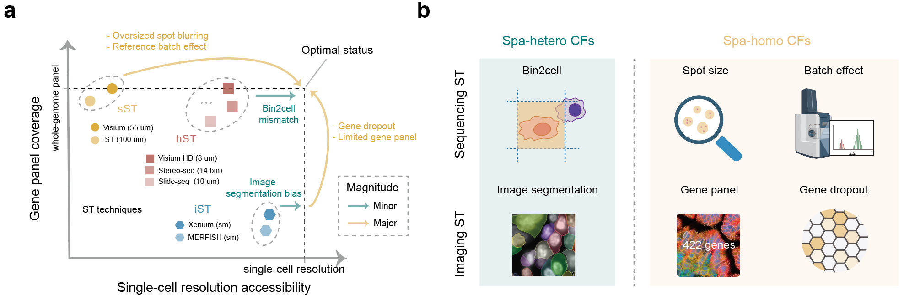
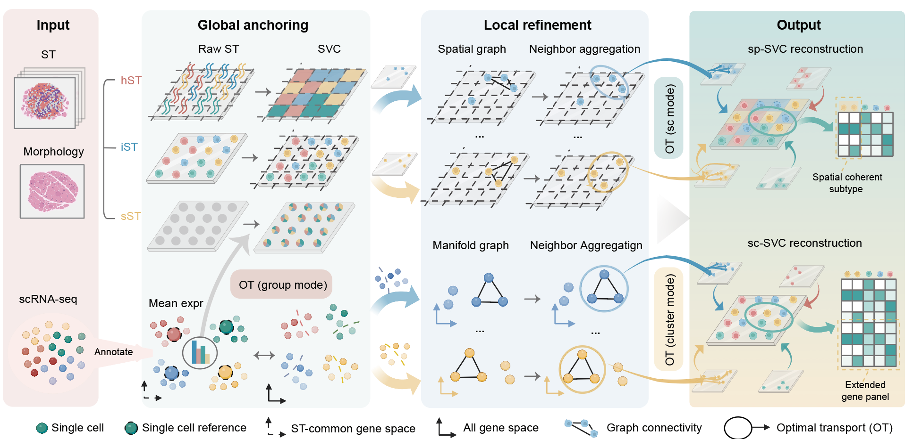
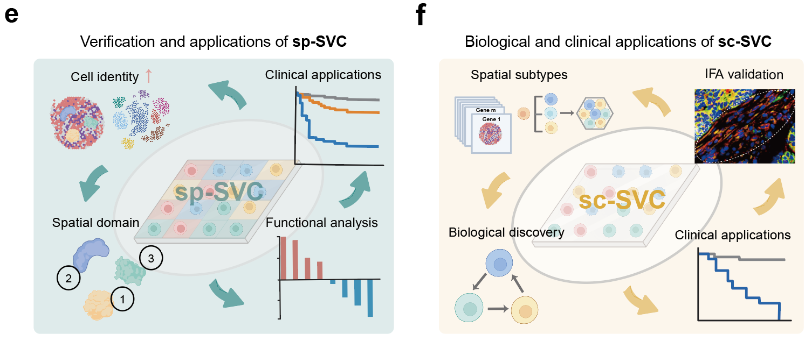

# REVISE

<p align="center">
  
  
  
</p>

[](https://pypi.org/project/revise-svc/)
[](https://revise-svc.readthedocs.io/en/latest/?badge=latest)
[](LICENSE)

REVISE (REconstruction via Vision-integrated Spatial Estimation) reconstructs
**Spatially-inferred Virtual Cells (SVCs)** from spatial transcriptomics data
and a matched single-cell RNA-seq reference. Spatial or morphology-derived
priors can be used when available.

## Quick start

REVISE supports Python 3.10 and 3.11. A clean environment is recommended.

<details>
<summary><strong>Create an environment with uv or conda</strong></summary>

With uv:

```bash
uv venv --python 3.11
source .venv/bin/activate
```

Or with conda:

```bash
conda create -n revise python=3.11 -y
conda activate revise
```

</details>

Install REVISE:

```bash
pip install revise-svc
```

Provide one spatial-transcriptomics H5AD and one matched single-cell reference.
The installed command is `revise-reconstruct`. First validate the resolved
inputs without running reconstruction:

```bash
revise-reconstruct \
  --svc-type sp-SVC \
  --sample-name sample \
  --data-root data \
  --st-file st.h5ad \
  --sc-ref-file sc_ref.h5ad \
  --output-root output \
  --dry-run
```

This example reads `data/sample_st.h5ad` and `data/sc_ref.h5ad`. Choose another
`--svc-type` using the guidance below, then remove `--dry-run` to reconstruct.
`sp-SVC` and `sc-SVC-sr` publish:

```text
output/sample/SVC.h5ad
```

Standard `sc-SVC` publishes its two reconstruction carriers separately:

```text
output/sample/sc-SVC/<cell-type>/sc_SVC_spatial.h5ad
output/sample/sc-SVC/<cell-type>/sc_SVC_expr.h5ad
```

The associated `provenance.json` records the selected type, resolved route,
configuration, inputs, stages, and artifacts. In a source checkout,
[`python reconstruct.py`](reconstruct.py) provides the equivalent entry point.

<details>
<summary><strong>Which --svc-type should I choose?</strong></summary>

| Your ST data | Typical platform and input rows | `--svc-type` | What REVISE reconstructs |
| --- | --- | --- | --- |
| **hST-like** high-resolution sequencing data | Visium HD; each row is a bin or pseudo-cell | `sp-SVC` | Reference-annotated expression with spatial refinement for the retained high-resolution units |
| **iST** imaging-based data | iST-like segmented-cell inputs, such as Xenium, CosMx, or MERFISH | `sc-SVC` | Segmented-cell positions combined with reference-informed cell-state refinement and gene completion |
| **sST** spot-based data | Visium; each row is a multi-cell spot | `sc-SVC-sr` | Reference-informed virtual-cell expression and cell-type composition within each spot |

`sc-SVC-sr` does not by itself infer true sub-spot cell positions. When the ST
H5AD contains segmentation-derived cell centers, REVISE uses them. Virtual
cells without a supplied center remain at their source spot center.

</details>

<details>
<summary><strong>Input file layout and AnnData requirements</strong></summary>

The example command resolves these paths:

```text
data/
├── sample_st.h5ad
└── sc_ref.h5ad
```

`--sample-name sample` and `--st-file st.h5ad` resolve to
`data/sample_st.h5ad`; the reference resolves directly to
`data/sc_ref.h5ad`.

- Both inputs must have non-empty `X`, unique `obs_names`, unique `var_names`,
  and at least one shared gene.
- The ST input must contain finite two-dimensional coordinates in
  `obsm["spatial"]`.
- Every route requires the configured broad annotation selected by
  `--cell-type-col` (default `obs["Level1"]`). Only standard `sc-SVC` requires
  the configured subtype annotation selected by `--sub-cell-type-col`
  (default `obs["Level2"]`). `sc-SVC-sr` composition and expression allocation
  use the broad assignment and do not require a subtype column.
- If the reference contains the default `Patient` column, at least one row must
  match `--sample-name`; use `--patient-key` to select another column.
- For sST inputs with segmentation-derived centers, the optional
  `uns["revise_cell_locations"]` table uses unique `cell_id` values as its
  index and contains `spot_name`, `x`, and `y`. Its cell IDs must agree with
  `uns["all_cells_in_spot"]`; `x/y` must use the same coordinate system and
  scale as `obsm["spatial"]`. Missing centers fall back to the spot center. A
  `PM_on_cell.csv` must cover every current virtual-cell ID and requested
  normalized cell type; extra Patient/case rows and class columns are allowed,
  and REVISE strictly subsets and reorders the active case matrix before use.
  Without that file, these coordinates are retained while cell types are
  assigned to the existing rows by a seeded random permutation of each spot's
  inferred quota.

</details>

<details>
<summary><strong>Frequently used reconstruction parameters</strong></summary>

- `--seed`: controls deterministic random choices; default `42`.
- `--ot-method pot|tacco`: selects one OT implementation for both Global
  Anchoring and Local Refinement. Standard `sc-SVC` defaults to TACCO and
  therefore requires the `tacco` extra; the other application profiles retain
  their configured solver. If TACCO is unavailable and a different algorithm
  is acceptable, explicitly pass `--ot-method pot`. REVISE never falls back
  automatically.
- `--select-ct`: for `sc-SVC`, reconstruct one broad cell type or use the
  default `all`.
- `--cell-type-col`: selects the broad reference annotation column for all
  three routes.
- `--sub-cell-type-col`: selects the refined annotation required only by
  standard `sc-SVC`; `sc-SVC-sr` does not require this column.

For advanced algorithm configuration, copy `revise/revise.yaml`, edit the
relevant profile, and pass it with `--config`.

Run `revise-reconstruct --help` for the complete command contract.

</details>

<details>
<summary><strong>Source installation, optional capabilities, and development setup</strong></summary>

To install the current repository source:

```bash
git clone https://github.com/wuys13/REVISE.git
cd REVISE
pip install .
```

The base package contains reconstruction, the POT implementation, clustering,
and the core scientific stack. Install additional capabilities only when
needed:

| Capability | Installation | Purpose |
| --- | --- | --- |
| Standard sc-SVC default solver | `pip install "revise-svc[tacco]"` | Installs TACCO 0.5.0, required by the default standard sc-SVC route |
| Pathway analysis | `pip install "revise-svc[pathway]"` | Dependencies used by pathway analysis notebooks |
| Cell-cell interaction analysis | `pip install "revise-svc[cci]"` | Dependencies used by CCI notebooks; databases and reference resources are prepared separately |
| Trajectory analysis | `pip install "revise-svc[trajectory]"` | Dependencies used by trajectory analysis notebooks |
| SpatialData input | `pip install "revise-svc[spatialdata]"` | SpatialData/Zarr input support |

For optional groups from a source checkout, replace `revise-svc` with `.`. For
development:

```bash
pip install -e ".[dev]"
```

Installation does not download research data or external analysis databases.

</details>

Detailed documentation: <https://revise-svc.readthedocs.io/en/latest/>

## What REVISE Covers

Sim2Real-ST benchmarks six confounding factors across spatial transcriptomics
platform types:

- Spatially heterogeneous factors: image segmentation artifacts and bin-to-cell
  assignment errors.
- Spatially homogeneous factors: spot size, batch effect, gene panel
  limitation, and gene dropout.



<p align="center">Confounding factors that limit current spatial transcriptomics technologies</p>

REVISE reconstructs three complementary SVC types:

- `sp-SVC`: spatial refinement for high-resolution spatial transcriptomics.
- `sc-SVC`: molecular completion and cell-state refinement for imaging-based
  spatial transcriptomics.
- `sc-SVC-sr`: spot-level super-resolution reconstruction.



<p align="center">Overview of the REVISE framework</p>

`sp-SVC` and `sc-SVC-sr` publish:

```text
<output-root>/<sample-name>/SVC.h5ad
```

`sc-SVC` publishes `sc_SVC_spatial.h5ad` and `sc_SVC_expr.h5ad` under
`<output-root>/<sample-name>/sc-SVC/<cell-type>/`. The run's
`provenance.json` records each result role together with the resolved route,
configuration, inputs, stages, and artifacts.

## Reproduce

Paper datasets and reproduced results are available from
<https://zenodo.org/records/17705737>. The repository keeps benchmark launchers
and curated notebooks under [`reproduce/`](reproduce/); see
[`reproduce/README.md`](reproduce/README.md) for the entry-point map.

<details>
<summary><strong>Run the Sim2Real-ST benchmarks</strong></summary>

From a source checkout, run one confounding family:

```bash
python reproduce/benchmark_main.py \
  --confounding segmentation \
  --data-root raw_data/Sim2Real-ST \
  --sample-name P2CRC/cut_part1 \
  --dataset-task segmentation \
  --output-root output/benchmark
```

Supported values are `segmentation`, `bin2cell`, `batch_effect`, `spot_size`,
`gene_panel`, and `gene_dropout`. Run the bounded multi-family launcher with:

```bash
bash reproduce/benchmark_main.sh
```

The analysis notebooks are under [`reproduce/benchmark/`](reproduce/benchmark/).

</details>

<details>
<summary><strong>Open the application and downstream-analysis notebooks</strong></summary>



<p align="center">Biological insights enabled by SVC reconstruction</p>

Application reconstruction and downstream-analysis notebooks are under
[`reproduce/case/`](reproduce/case/). Some require the optional `pathway`,
`cci`, or `trajectory` installation groups and their corresponding external
reference resources.

</details>

<details>
<summary><strong>Reproduction scope and validation status</strong></summary>

The notebooks preserve the paper workflows, but their presence does not mean
that the current source checkout has rerun every real-data analysis. Real-data
end-to-end validation remains a separate release step. Installation does not
download the paper datasets, reproduced results, or external analysis
databases.

</details>

## Python API

<details>
<summary><strong>Run the reconstruction pipeline from Python</strong></summary>

```python
from revise.framework import REVISEPipeline

pipeline = REVISEPipeline()
svc = pipeline.run(
    profile="application_sc",
    runtime_overrides={"platform": "sc_svc", "confounding": "segmentation"},
    io_overrides={
        "data_root": "raw_data/Real_application",
        "output_root": "output/sc_SVC_case",
        "sample_name": "P2CRC",
        "st_file": "Xenium.h5ad",
        "sc_ref_file": "adata_sc_all_reanno.h5ad",
        "patient_key": "Patient",
    },
)
```

</details>

## Repository Layout

<details>
<summary><strong>Show the top-level repository structure</strong></summary>

- `revise/`: installable reconstruction and analysis package.
- `reproduce/`: benchmark launchers and benchmark/application notebooks.
- `docs/`: detailed user and method documentation.
- `logo/`, `png/`: public project and scientific figures.
- `tests/`: behavioral, scientific-contract, packaging, and CLI tests.
- `.github/`: continuous integration.
- `constraints/`: tested Python 3.10/3.11 dependency constraints.

</details>

## License

REVISE is released under the [MIT License](LICENSE). Third-party datasets and
notebook resources may have separate terms.
