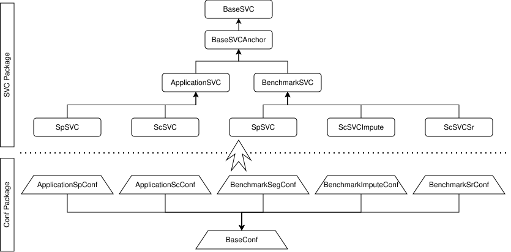

# REVISE

<p align="center">
  
</p>

[](LICENSE)

REVISE (REconstruction via Vision-integrated Spatial Estimation) is a
configuration-driven pipeline for reconstructing Spatially-inferred Virtual
Cells (SVCs) from spatial transcriptomics data and a matched single-cell
reference. The current candidate supports hST, iST, and sST routes through one
public command and one pipeline lifecycle.

This checkout is a `0.1.0rc1` release candidate. Local gates exercise its
package, CLI, POT paths, small TACCO solver smokes, provenance, and failure
behavior; CI defines the corresponding candidate gates. Real-data end-to-end
scientific validation has deliberately not been run for this candidate yet, so
this repository does not claim biological validation or production-scale
readiness.

## Installation

The candidate gate matrix targets Python 3.10 and 3.11. To install this
candidate from a source checkout:

```bash
python -m pip install .
```

Or install the exact candidate Wheel produced by the release build:

```bash
python -m pip install /path/to/revise_svc-0.1.0rc1-py3-none-any.whl
```

POT, Leiden, and the core scientific stack are base dependencies. Add an
optional domain to the exact Wheel without relying on a checkout:

```bash
python -m pip install "/path/to/revise_svc-0.1.0rc1-py3-none-any.whl[tacco]"
```

From a source checkout, optional domains are installed only when used:

```bash
python -m pip install ".[tacco]"       # TACCO 0.5.0 as an OT solver
python -m pip install ".[pathway]"     # pathway analysis
python -m pip install ".[cci]"         # CCI notebook dependencies
python -m pip install ".[trajectory]"  # trajectory notebook dependency
python -m pip install ".[spatialdata]" # SpatialData Zarr input
```

The CCI extra installs Python dependencies only. It does not download a
CellPhoneDB database or any research data.

The PyPI/DOI/data-archive status of this candidate is pending owner
confirmation; `pip install revise-svc` is therefore not presented here as a
verified way to obtain these exact RC bytes.

## Three real entry paths

- **Installed command:** `revise-reconstruct` is the canonical reconstruction
  interface.
- **Source compatibility wrapper:** `python reconstruct.py` calls the same CLI
  implementation from a repository checkout.
- **Paper reproduction compatibility:** `python benchmark_main.py` and
  `bash benchmark_main.sh` retain the checkout-only benchmark workflows. The
  legacy `application_*_recon.py` wrappers remain for the existing notebooks;
  they are not the canonical installed interface.

## Quick start

For `--sample-name sample`, `--st-file st.h5ad`, and
`--sc-ref-file sc_ref.h5ad`, prepare the resolver's flat application layout:

```text
data/
├── sample_st.h5ad
└── sc_ref.h5ad
```

Both AnnData inputs need non-empty `X`, unique `obs_names`, and unique
`var_names`; the ST input also needs two-dimensional coordinates in
`obsm["spatial"]`. With the default column arguments, hST requires reference
`obs["Level1"]`, while iST and sST require both `obs["Level1"]` and
`obs["Level2"]`. The two inputs must share genes.

Run the installed command with the base POT solver:

```bash
revise-reconstruct \
  --platform hST \
  --sample-name sample \
  --data-root data \
  --st-file st.h5ad \
  --sc-ref-file sc_ref.h5ad \
  --output-root output \
  --ot-method pot
```

From the source checkout, replace only the command name:

```bash
python reconstruct.py \
  --platform hST \
  --sample-name sample \
  --data-root data \
  --st-file st.h5ad \
  --sc-ref-file sc_ref.h5ad \
  --output-root output \
  --ot-method pot
```

Use `--dry-run` to resolve and inspect input/dependency readiness without
running reconstruction. Dry-run does not prove that the scientific kernels will
complete successfully.

## Output contract

Every successful full reconstruction run through the installed/source CLI
publishes exactly one platform result; `--dry-run` publishes no H5AD:

```text
<output-root>/<sample-name>/<platform>-SVC.h5ad
```

The concrete filenames are `hST-SVC.h5ad`, `iST-SVC.h5ad`, and
`sST-SVC.h5ad`. The result links to its canonical run directory, whose
`provenance.json` records stage state, configuration identity, solver events,
and completed artifact hashes. A run can also contain route-specific internal
artifacts; those are evidence, not additional public result contracts.

## OT selection

REVISE has two explicit OT stages:

- GA (Global Anchoring): `ot.ga.solver`
- LR (Local Refinement): `ot.lr.solver`

Both accept `pot` or `tacco`. `--ot-method pot` or `--ot-method tacco`
sets GA and LR together. If `--ot-method` is omitted, the two values already in
the merged configuration remain in effect and can be selected independently
with `--set ot.ga.solver=...` and `--set ot.lr.solver=...`.

TACCO is optional and pinned to the supported 0.5.0 line. Requesting TACCO when
it is missing, incompatible, or unable to solve the requested problem fails
explicitly; REVISE does not fall back to POT. Successful POT and TACCO runs are
not evidence that the two solvers are biologically equivalent.

## sST Spot SR without `pm_on_cell`

For an application run the only resolved score-matrix location is the
case-sensitive `<data-root>/PM_on_cell.csv`; the CLI has no path override. When
that file is present, REVISE optimizes the assignment of cell-type quota slots.
When it is absent, each spot's proportions are converted with `np.round`,
repaired deterministically to an exact quota, and then assigned to the existing
virtual-cell rows with one seeded random permutation. The same seed reproduces
the allocation; another seed may change which row receives each label while
preserving the quota.

This proves within-spot composition and deterministic random allocation only.
It is not a nucleus or cell-localization result, and it does not infer true
within-spot biological positions.

## Benchmark metrics

Paper reproduction uses `python benchmark_main.py` for one confounding family
and `bash benchmark_main.sh` for the bounded multi-family launcher. A family
may contain several leaf runs. Benchmark metrics are per-gene PCC, SSIM, MSE,
and NRMSE after the implemented alignment and normalization. SSIM consumes the
aligned observation sequence in row order; it is not an image-registered
spatial SSIM. NRMSE uses the normalized ground-truth mean as its denominator
and is directional. Constant and zero-mean genes may produce `NaN` or positive
infinity instead of being silently repaired. See the benchmark documentation
for the exact formula and limits.

## Evidence boundary

The installed POT end-to-end smoke uses small synthetic 52-observation by
52-gene inputs. Larger checks cover individual components, not a complete
production-scale pipeline. No real-data end-to-end run, biological result
reproduction, cross-solver biological parity study, or production-scale
performance claim is included in the current candidate evidence.

External research-data identities, a DOI/BibTeX record, named project roles,
and release contact details are pending owner confirmation. Executed notebooks
and historical research assets remain in the exact `REVISE-legacy` source
commit recorded by the clean repository's `legacy-assets.json`; they are not
part of the product distribution or current scientific evidence.

## Development checks

```bash
PYTEST_DISABLE_PLUGIN_AUTOLOAD=1 python -m pytest -q -p no:capture
python -m compileall -q benchmark_main.py revise
ruff check revise/
black --check revise/
```

The repository also contains strict distribution, release-manifest, and Sphinx
documentation gates. None of these gates download research data.

## License

Code is released under the [MIT License](LICENSE). Third-party data and
notebook outputs may have separate terms; their official identities and terms
must be confirmed before redistribution.
