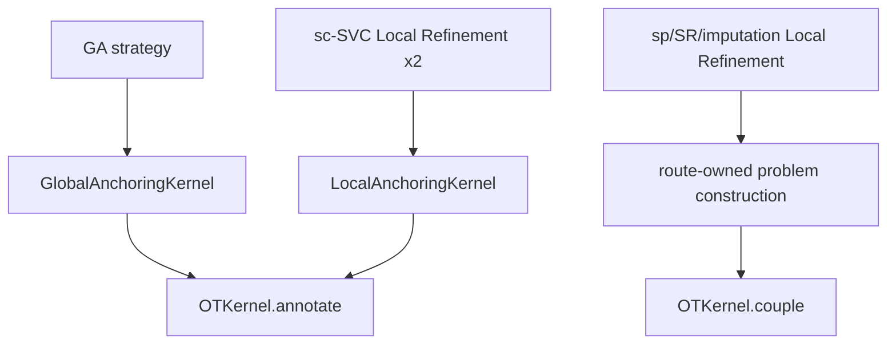

# OT Boundaries and Contracts

Parent index: [Reconstruction Unification Design Package](README.md)

## Baseline problem

Current fact：`GlobalAnchoringKernel` 同时拥有 annotation problem construction 与 POT/TACCO solver 调用；`LocalAnchoringKernel` 的 Application sc-SVC TACCO 分支复制 config 后调用 `GlobalAnchoringKernel`；其他 LR runner 直接调用 `solve_local_ot`。这违反“后两次 TACCO 属于 sc-SVC LR”的架构语义，也使 solver 调用位置无法统一审计。

## Decided dependency shape

Forbidden edges：

- LR Module/runner/strategy → `GlobalAnchoringKernel`
- `OTKernel` → runner、runner config、GA kernel 或 LR kernel
- `OTKernel.annotate` → `OTKernel.couple`
- `OTKernel.couple` → `OTKernel.annotate`
- production code outside `OTKernel` → `tacco.tl.annotate`、`tacco.utils.solve_OT`、`ot.unbalanced.sinkhorn_unbalanced`

## `OTKernel.annotate`

Decided target：固定 named inputs，至少包含完整 target/reference AnnData、label key、method 和显式 solver parameters；不接受任意 `options` dict 或完整 runner config。

输出为新 annotated target AnnData，包含：

- `obsm[label_key]`：TACCO/POT posterior DataFrame；
- `obs[label_key]`：posterior row argmax；
- `obs[confidence_key]`：posterior row maximum。

Annotation contract：

1. 不污染 caller 的 reference；TACCO reference input 使用 copy。
2. TACCO 每次使用 fresh result key，必须验证该 key 被本次调用写入，并在发布正式 key 前删除临时 key。
3. `return_reference=True` 必须得到 `(annotated_target, processed_reference)` 形状；processed reference 不替换 caller reference。
4. target observation index 必须完整且同序。
5. posterior category 轴必须唯一、非空且与 reference label set 完全一致。
6. TACCO 返回 category 顺序为权威；不按 reference 首次出现顺序重排。
7. posterior 数值必须 finite、non-negative、每行存在可取 argmax 的有效值；不自动重新归一化。

## `OTKernel.couple`

Decided target：固定 named inputs包含 source mass、target mass、cost matrix、method、POT regularization 参数及可选 reference measure/support mask。route 负责 problem construction，kernel 只负责验证和求解。

Shared contract：

- cost shape 精确等于 `(source size, target size)`；masses finite、non-negative 且总质量为正。
- coupling shape、finite 和 non-negative 必须验证。
- support mask 之外保持 hard zero；既有 zero-mass/unsupported row/column stabilization 语义保留。
- 不把空 active support 自动解释成另一 solver 或另一数据子集。

POT contract：

- 保留 caller dtype，除非输入 cost 不是 floating；不得因统一 wrapper 无条件改成 float64。
- 调用 `ot.unbalanced.sinkhorn_unbalanced`，保留 `reg`、`reg_m`、`reg_type`、verbose 和 iteration 参数。
- 可接收显式 reference measure；shape 必须与完整 cost 一致。
- wrapper 返回 raw validated coupling；route-owned row normalization 继续在原算法位置执行。

TACCO matrix contract：

- normalize active marginals 并按 TACCO contract 显式提升 dtype。
- 不支持 reference measure；收到时直接失败。
- 调用 `tacco.utils.solve_OT`，保留原 epsilon/lambda/iteration/relaxation 等求解参数。
- 保留 hard-support feasibility 检查和 marginal continuation；只延续同一可行 TACCO orbit，不构成 solver fallback。
- continuation 后仍不满足 total/source/target marginal tolerance 时失败，不伪装为成功。
- 将 active coupling 填回完整 shape，非 active/support 位置保持零。

## GA and LR ownership

`GlobalAnchoringKernel` 仍负责 GA-specific problem construction、结果发布和 facade 名称，但真实 solver 调用委托 `OTKernel`。

`LocalAnchoringKernel` 负责 sc-SVC annotation LR 的 label key 与 route context，不复制 GA config，也不实例化 GA kernel。两次调用分别是：

1. selected spatial cohort ← selected sc reference，label=`Level2`；
2. selected sc reference ← clustered spatial SVC，label=`SVC_cluster`。

其他 LR 继续保留各自 masses/cost/support、graph、allocation 和 aggregation 实现，只把最终 coupling 调用改为 `OTKernel.couple`。底层统一不意味着强迫 route 共享 problem construction。

## Required static and behavioral evidence

- AST/rg guard：三种 solver 调用只存在于 `OTKernel` 文件。
- AST/rg guard：LR 文件与 runner 不含 `GlobalAnchoringKernel` import、symbol 或构造。
- import-boundary test：`OTKernel` 不导入 runners、runner_conf 或 stage kernels。
- focused annotation tests：fresh key、copy/no pollution、TACCO category order、无自动 normalization。
- focused coupling tests：POT dtype/row-normalization ownership、TACCO hard support/marginal continuation、reference-measure rejection。
- route spies：sc-SVC 恰好执行 GA annotation 一次、LR annotation 两次，并能区分 caller。

继续阅读：[Application entry and preprocessing](04-application-entry-and-preprocessing.md)。
