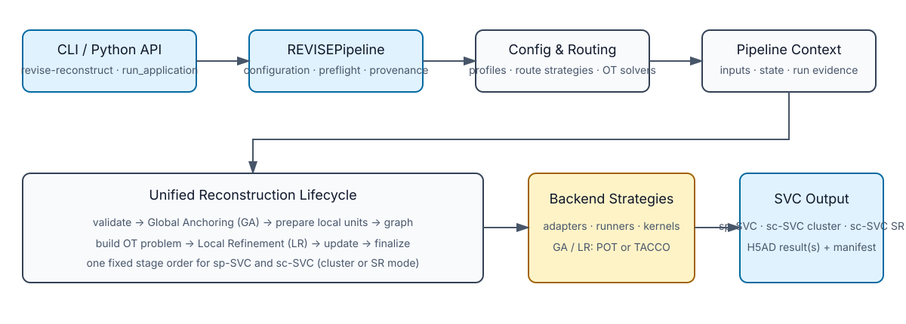

API
===

The stable public Application Python entry point is ``run_application``. It
accepts the same YAML contract as the CLI. ``REVISEPipeline`` remains the
engine-level interface; Benchmark callers select one confounding family with
``cf``. The package-owned router then resolves the profile and strategy.

Start with :doc:`../quickstart` for runnable examples and :doc:`../architecture`
for the full lifecycle. This page is the reference surface for classes and
extension points.

   Current API architecture.

.. code-block:: python

    from reconstruct import run_application

    result = run_application("configs/application/VisiumHD.yaml")

``sp-SVC`` and ``sc-SVC-sr`` return one ``AnnData``. ``sc-SVC`` returns the
fixed ``(spatial, expression)`` pair, and a dry run returns ``None``.

Pipeline
~~~~~~~~

Application entry point
~~~~~~~~~~~~~~~~~~~~~~

.. autosummary::
    :toctree: generated
    :nosignatures:

    reconstruct.run_application

The engine pipeline remains available for Benchmark and advanced integrations:

.. autosummary::
    :toctree: generated
    :nosignatures:

    revise.framework.REVISEPipeline
    revise.recon.context.PipelineContext
    revise.recon.pipeline.UnifiedReconstructionPipeline
    revise.svc.SVC

Configuration
~~~~~~~~~~~~~

``revise.config.authority`` is the package-owned typed engine configuration
and routing authority; application YAML is the external request surface.
``revise.config.runner_conf`` contains internal runner contracts used by
backend adapters and compatibility notebooks.

.. autosummary::
    :toctree: generated
    :nosignatures:

    revise.config.runner_conf.ApplicationSpConf
    revise.config.runner_conf.ApplicationScConf
    revise.config.runner_conf.ApplicationScSrConf
    revise.config.runner_conf.BenchmarkSrConf
    revise.config.runner_conf.BenchmarkSegConf
    revise.config.runner_conf.BenchmarkImputeConf

Analysis
~~~~~~~~

``SpSVCAnalysisService`` retains the existing clustering-metrics facade for a
unified ``SVC`` result. The unused exported ``ScSVCAnalysisService`` was
removed as an unreleased breaking cleanup on the ``0.1.0rc1`` development
line; sc-SVC notebooks continue to use the backend compatibility runner while
downstream computation moves to capability modules.

.. autosummary::
    :toctree: generated
    :nosignatures:

    revise.analysis.SpSVCAnalysisService
    revise.analysis.compute_metric
    revise.analysis.compute_clustering_metrics

Capability APIs
~~~~~~~~~~~~~~~

Reusable computation is grouped by capability. Plotting, case selection,
sampling, and artifact persistence remain in the analysis notebooks.

.. autosummary::
    :toctree: generated
    :nosignatures:

    revise.analysis.basic.differential_expression.get_degs
    revise.analysis.basic.unsupervised.compute_leiden_sweep
    revise.analysis.basic.spatial_autocorrelation.compute_groupwise_spatial_autocorrelation
    revise.analysis.basic.gene_set_scoring.read_gmt
    revise.analysis.basic.gene_set_scoring.score_genes
    revise.analysis.advanced.enrichment.get_enrichment
    revise.analysis.advanced.enrichment.get_enrichment_local
    revise.analysis.advanced.aucell.score_gene_set_aucell
    revise.analysis.advanced.cell_communication.run_cellphonedb_v5
    revise.analysis.advanced.cell_communication.normalize_cellphonedb_tables
    revise.analysis.advanced.trajectory.infer_palantir

Strategy contract and registry
~~~~~~~~~~~~~~~~~~~~~~~~~~~~~~

These classes are the extension points used by the unified backend.

.. autosummary::
    :toctree: generated
    :nosignatures:

    revise.backend.registry.StrategyRegistry
    revise.backend.contracts.LocalRefinementStrategy

Backend Compatibility Runners
~~~~~~~~~~~~~~~~~~~~~~~~~~~~~

These classes are kept for notebooks, parity checks, and low-level debugging.
New Application code should import ``run_application`` from ``reconstruct``.
Benchmark and low-level integration code may use ``REVISEPipeline`` or the
benchmark entrypoint.
Direct sp-SVC and sc-SVC-sr runner callers receive the resolved
``local_refinement_strength`` value. Standard sc-SVC and imputation callers do
not provide it. Assignment ``Q`` is validated at the global-assignment boundary
and is not synthesized or repaired inside a runner.

.. autosummary::
    :toctree: generated
    :nosignatures:

    revise.backend.runners.sp_svc_application.SpSVC
    revise.backend.runners.sc_svc_application.ScSVC
    revise.backend.runners.sc_svc_sr_application.ScSVCSr
    revise.backend.runners.sp_svc_benchmark.SpSVC
    revise.backend.runners.sc_svc_sr_benchmark.ScSVCSr
    revise.backend.runners.sc_svc_impute_benchmark.ScSVCImpute
